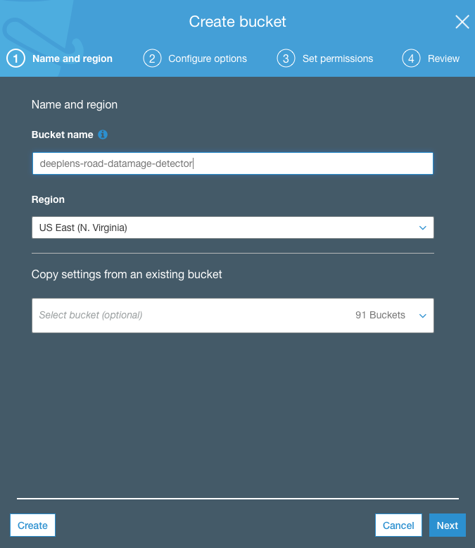
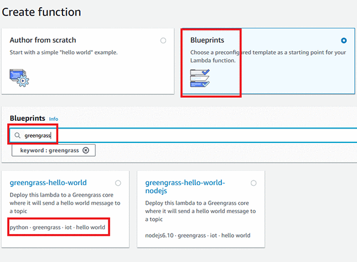
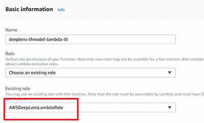
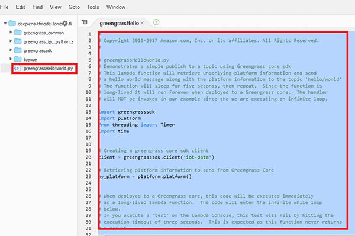
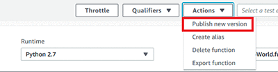
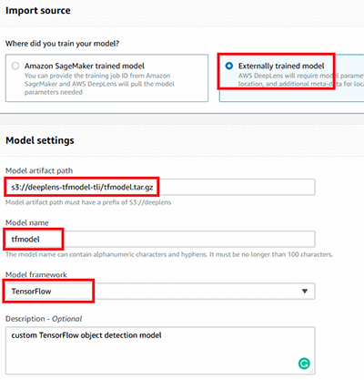
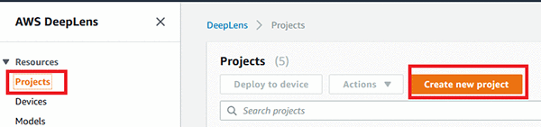
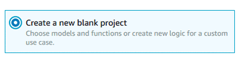
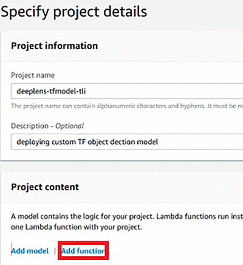
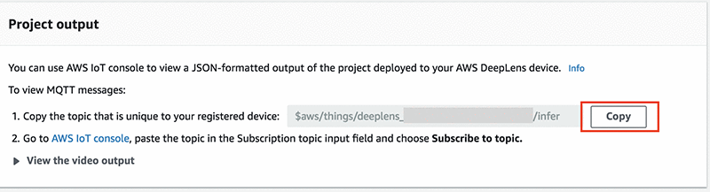

### Introduction
In this lab we will walkthrough detecting road surface damage using SSD model and deploy it on Amazon Deeplens. 

Object detection is the process of identifying and localizing objects in an image. A typical object detection solution takes in an image as input and provides a bounding box on the image where an object of interest is, along with identifying what object the box encapsulates. We will be using this model developed using AWS Sagemaker.  We will show you how to deploy this model on Deeplens and do inferencing that will detect and classifiy road surface damange.

### The Definition of Road Damage


## First download pre-built model
 
Click link below to [download](https://s3.amazonaws.com/deeplens-roaddamage-user-2-8/roaddamagemodel.tar.gz)

You will need to upload this model to your own s3 bucket later.

### Implementation steps

The following sections walk you through the implementation steps.


#### Step 1: Prerequisites

Make sure to register your AWS Deeplens device before you begin. You can follow this [link](https://docs.aws.amazon.com/deeplens/latest/dg/deeplens-getting-started-register.html) for a step-by-step guide to register the device.


#### Step 2: Upload the downloaded model file to Amazon S3

In this section, you will upload the tar file to Amazon S3 so the AWS DeepLens service can deploy it to the Deeplens device for local inference.

Open the AmazonS3 console.



Create an Amazon S3 bucket in the Northern Virginia Region that *** bucket name must start with the term *** “deeplens” ***. 

The AWS Deeplens default role has permission only to access the bucket with the name containing ”deeplens”. You can name it deeplens-roaddamagedetection-yourinitials

After the bucket is created, upload the downloaded model .tar file to the bucket.

### Create lambda function

In this section, you’ll create a custom Lambda function that will be deployed as part of the AWS Deeplens deployment. 

This Lambda function contains code to load the custom model that was downloaded from the S3 bucket mentioned previously. This allows you to perform local inferencing (object detection) without connecting back to the AWS Cloud.

Open the AWS Lambda console.

Create a new function from a blueprint, make sure to search for AWS Greengrass and select the Python version (2.7).



Give the function a meaningful name and select AWSDeepLensLambdaRole from Existing role drop-down list. Then create the function. Note: If you do not see this role, make sure that you registered your AWS DeepLens device. The role is automatically created during the registration process.



In the function editor, copy and paste the following code into greengrassHelloWorld.py. 



***Note: Do not rename the file or the function handler, leave everything at the default.

```python

#*****************************************************
#                                                    *
# Copyright 2018 Amazon.com, Inc. or its affiliates. *
# All Rights Reserved.                               *
#                                                    *
#*****************************************************
""" A sample lambda for object detection"""
from threading import Thread, Event
import os
import json
import numpy as np
import awscam
import cv2
import greengrasssdk


def greengrass_infinite_infer_run():
    """ Entry point of the lambda function"""
    try:
        # This object detection model is implemented as single shot detector (ssd), since
        # the number of labels is small we create a dictionary that will help us convert
        # the machine labels to human readable labels.
        model_type = 'ssd'
        output_map = {1:'D00', 2: 'D01', 3:'D10', 4:'D11', 5:'D20', 6:'D40', 7:'D43', 8:'D44'}

        # Create an IoT client for sending to messages to the cloud.
        client = greengrasssdk.client('iot-data')
        iot_topic = '$aws/things/{}/infer'.format(os.environ['AWS_IOT_THING_NAME'])
        # Create a local display instance that will dump the image bytes to a FIFO
        # file that the image can be rendered locally.

        # The sample projects come with optimized artifacts, hence only the artifact
        # path is required.
        model_name = 'model_algo_1'
        model_path = '/opt/awscam/artifacts/model_algo_1.xml'
        # Load the model onto the GPU.
        client.publish(topic=iot_topic, payload='Loading object detection model')
        model = awscam.Model(model_path, {'GPU': 1})
        client.publish(topic=iot_topic, payload='Object detection model loaded')
        # Set the threshold for detection
        detection_threshold = 0.60
        # The height and width of the training set images
        input_height = 600
        input_width = 600
        
        # Do inference until the lambda is killed.
        while True:
            # Get a frame from the video stream
            ret, frame = awscam.getLastFrame()
            if not ret:
                raise Exception('Failed to get frame from the stream')
                
            frame_resize = cv2.resize(frame, (input_height, input_width))
            parsed_inference_results = model.parseResult(model_type,
                                                         model.doInference(frame_resize))
            # Dictionary to be filled with labels and probabilities for MQTT
            cloud_output = {}
            # Get the detected objects and probabilities
            for obj in parsed_inference_results[model_type]:
                if obj['prob'] > detection_threshold:
                    # Store label and probability to send to cloud
                    cloud_output[output_map[obj['label']]] = obj['prob']
            # Set the next frame in the local display stream.
            client.publish(topic=iot_topic, payload=json.dumps(cloud_output))
    except Exception as ex:
        client.publish(topic=iot_topic, payload='Error in object detection lambda: {}'.format(ex))

greengrass_infinite_infer_run()

```

Save the Lambda function.


To ensure code integrity and consistency, AWS DeepLens only works with the published version of a Lambda function. 

To publish a Lambda function, choose ***Actions*** and select ***Publish*** new version.


Give a description to the published version and choose Publish.




#### Setting up an AWS DeepLens project and deploying a custom object detection model

1. Open the AWS DeepLens console.

2. Make sure your DeepLens device is registered before you begin. You can follow this [link](https://youtu.be/j0DkaM4L6n4)  for a step-by-step guide to register the device.

3. Make sure you are in the same region where you created the S3 bucket. At the time of writing, AWS DeepLens is only available in the Northern Virginia Region.

4. In the AWS DeepLens console, in the left navigation panel, choose Models. Then choose Import model.

5. On the Import model page, choose Externally trained model. In the Model artefact path, enter the S3 bucket and model path you created earlier. Give it a meaningful name and description, and make sure to choose MXNet as the model framework. Choose Import model.



In the left navigation panel, choose Project. Then choose Create new project.




Create a new blank project.




Give your project a meaningful name and description, and then choose Add model.

In the AWS DeepLens console, in the left navigation panel, choose Models. Then choose Import model.

On the Import model page, choose Externally trained model. In the Model artefact path, enter the S3 bucket and model path you created earlier. Give it a meaningful name and description, and make sure to choose Mxnet as the model framework. Choose Import model.


Select the model that you imported earlier, and then choose Add model.


On the project detail page, choose Add function.



Choose the Lambda function you created earlier, then choose Add function.

Choose Create to create the project. On the project page, select the new project that you just set up, and choose Deploy to device.


Select the AWS DeepLens device that you want to deploy the project to, choose Review, and then chose Deploy. The deployment process will take few minutes because the AWS DeepLens device needs to download the model tar file from S3 and the Lambda function to execute locally on the device.

The status pane at the top of the screen displays deployment progress. Wait until it turns green and displays status that the deployment succeeded.


In the Device details pane, copy the MQTT topic, and then navigate to the AWS IoT console.




In the AWS IoT console, in the left navigation pane choose Test, paste the MQTT topic copied in the previous step, then choose Subscribe to topic.


Detected objects and their prediction confidence score are sent in real time through MQTT to the AWS IoT platform.

### Conclusion

In this lab, you learned how to deploy a Road Surface Damage detection model to AWS DeepLens. This enables AWS Deeplens to perform real-time object detection using the built-in camera. You can see that it’s possible to use AWS services to build some very powerful AI solutions. 


### Citation:

Maeda, H., Sekimoto, Y., Seto, T., Kashiyama, T., & Omata, H. Road Damage Detection and Classification Using Deep Neural Networks with Smartphone Images. Computer‐Aided Civil and Infrastructure Engineering.

@article{maedaroad, title={Road Damage Detection and Classification Using Deep Neural Networks with Smartphone Images}, author={Maeda, Hiroya and Sekimoto, Yoshihide and Seto, Toshikazu and Kashiyama, Takehiro and Omata, Hiroshi}, journal={Computer-Aided Civil and Infrastructure Engineering}, publisher={Wiley Online Library} }
